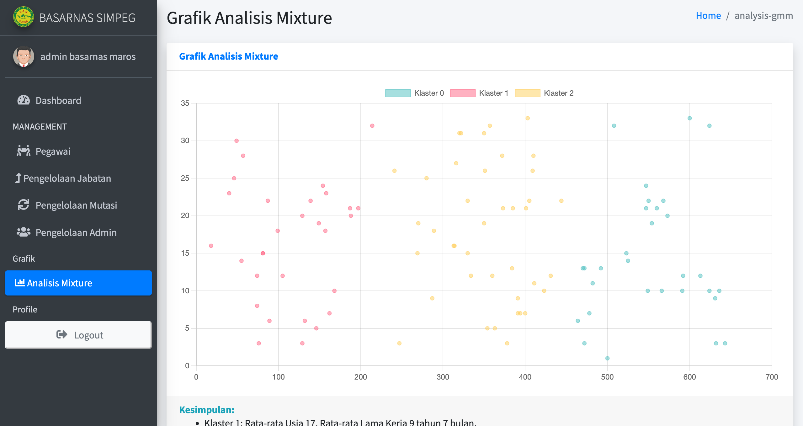

<h1 style="color:blue">SISTEM INFORMASI KEPEGAWAIAN</h1>

<h3>Screenshot</h3>





<h2 style="color:cyan">Installation</h2>
<ul>
    <li>Clone the Repo: <br> </li>
    <li style=""> > git clone https://github.com/didins97/simkah.git</li>
    <li> > cd simkah</li>
    <li> > composer install or composer update</li>
    <li> > cp .env.example .env</li>
    <li> > Set up .env file</li>
    <li> > php artisan key:generate</li>
    <li> > php artisan storage:link</li>
    <li> > php artisan migrate:fresh --seed</li>
    <li> > php artisan serve</li>
    <li> <a href="http://127.0.0.1:8000/">http://127.0.0.1:8000/</a> </li>
</ul>

Install Rubix ML into your project using [Composer](https://getcomposer.org/):
```sh
$ composer require rubix/ml
```


<p style="color:yellow">If you like our project please leave a star ❤<p>
